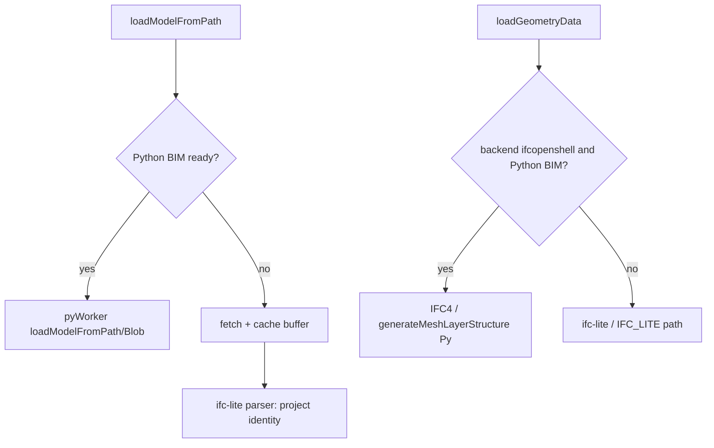

# Architecture Flowchart

```mermaid
flowchart TD
  loadPath[loadModelFromPath]
  pyReady{Python BIM ready?}
  pyApi[pyWorker loadModelFromPath/Blob]
  fetch[fetch + cache buffer]
  liteMeta[ifc-lite parser: project identity]
  loadPath --> pyReady
  pyReady -->|yes| pyApi
  pyReady -->|no| fetch
  fetch --> liteMeta

  loadGeo[loadGeometryData]
  wantShell{backend ifcopenshell and Python BIM?}
  loadGeo --> wantShell
  wantShell -->|yes| ifc4[IFC4 / generateMeshLayerStructure Py]
  wantShell -->|no| liteGeo[ifc-lite / IFC_LITE path]
```
